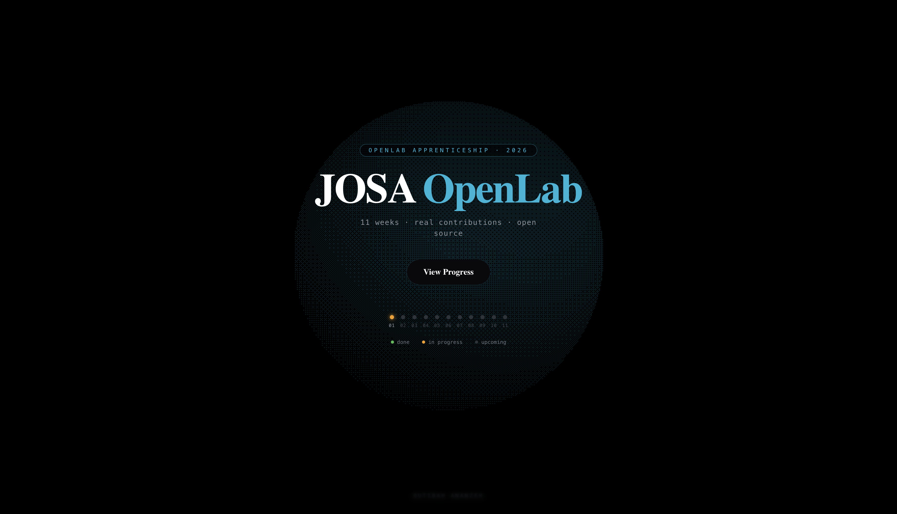
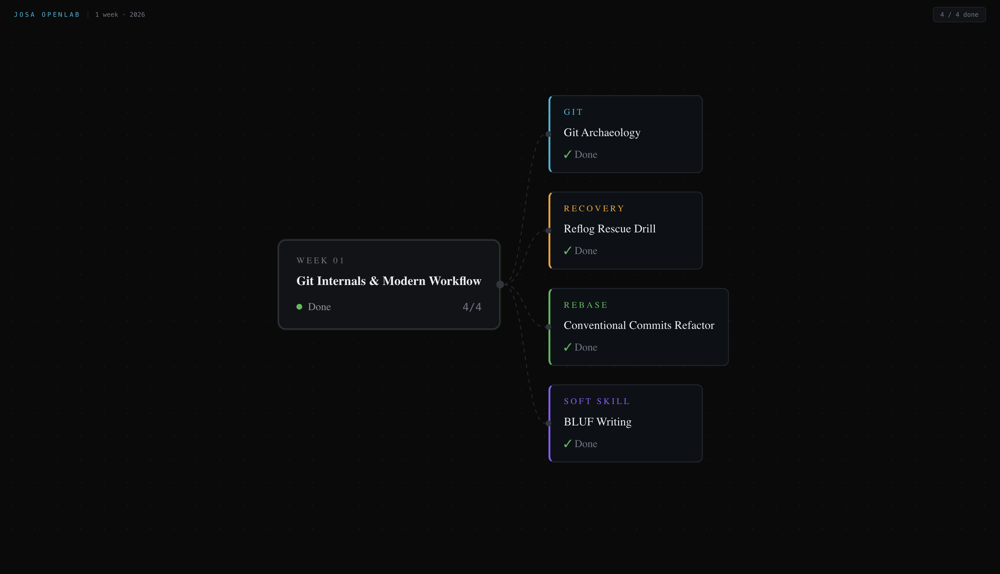

# Ti's Progress

My progress through the JOSA OpenLab apprenticeship, week by week.

<p align="center">
  <a href="https://josa-openlab.github.io/Ti-progress">
    
  </a>
  <a href="PROGRESS.md">
    
  </a>
</p>

## Weekly log

Prefer reading here instead of the site? Every week is a markdown file, grouped by month:

```
Month1/   week-01.md  week-02.md  week-03.md
Month2/   week-04.md  week-05.md  week-06.md  week-07.md
Month3/   week-08.md  week-09.md
Month4/   week-10.md
```

| Month | Weeks |
|---|---|
| [Month1](Month1/) · May 2026 | [01](Month1/week-01.md) Git Internals & Modern Workflow · [02](Month1/week-02.md) PR Etiquette · [03](Month1/week-03.md) Issue Triage |
| [Month2](Month2/) · June 2026 | [04](Month2/week-04.md) Code Review · [05](Month2/week-05.md) Testing & CI/CD · [06](Month2/week-06.md) Docs as Code · [07](Month2/week-07.md) Security |
| [Month3](Month3/) · July 2026 | [08](Month3/week-08.md) Performance & Profiling · [09](Month3/week-09.md) Own OSS Project |
| [Month4](Month4/) · August 2026 | [10](Month4/week-10.md) Project Research & Ideation |

Full index: [PROGRESS.md](PROGRESS.md)

<table>
  <tr>
    <td></td>
    <td></td>
  </tr>
</table>

## Repo layout

```
Month1..Month4/   the weekly log, one markdown file per week
PROGRESS.md       full index of every week
site/             the Next.js site behind josa-openlab.github.io/Ti-progress
```

Both views come from the same source, `site/data/weeks/*.json`. Edit that, then:

```bash
cd site
npm run docs    # regenerate Month*/ and PROGRESS.md
npm run build   # build the site into site/out
```

CI blocks the deploy if `Month*/` is out of date with the JSON, so the page and the
repo can never disagree.
